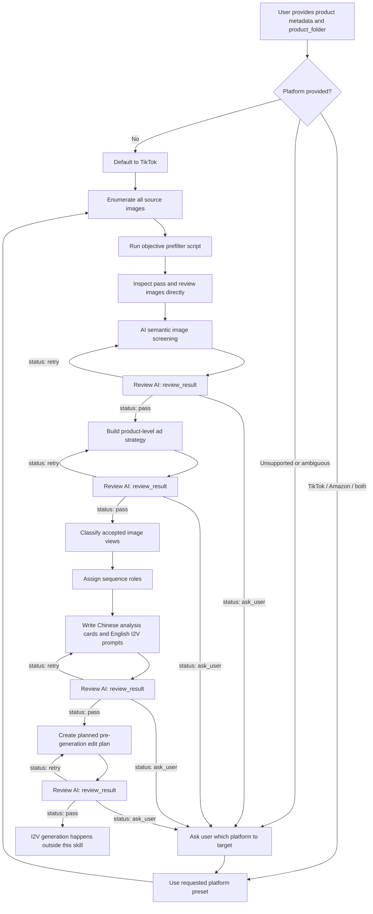

# I2V Prompt Skill

A Claude Code skill for generating stage-one structured image-to-video prompts for overseas ecommerce household and lifestyle product ads.

## What this repository contains

- `ecom-i2v-ad-prompts/` — the main skill definition and reference materials
- `ecom-i2v-prompt-generator/` — optimized prompt generator skill that writes `01_storyboard_plan.md` and `02_i2v_prompt_manifest.json`
- `ecom-i2v-video-workflow/` — executable video workflow skill that consumes the prompt manifest, generates clips, reviews them, builds `04_final_edit_plan.json`, and assembles the final video
- `ecom-i2v-ad-prompts/scripts/prefilter_images.py` — objective image prefilter script
- `quick_validate.py` — repository contract validator
- `requirements.txt` — Python dependency list for prefiltering and validation
- `docs/` — design and supporting documentation
- `validation/` — local validation outputs and test artifacts, excluded from GitHub upload

## Skill purpose

This skill is designed for a single product folder that contains multiple product images.

The repository now separates the workflow into two newer skills:

1. `ecom-i2v-prompt-generator`: planning and prompt package generation only.
2. `ecom-i2v-video-workflow`: I2V model execution, clip review, final edit planning, and ffmpeg assembly.

It helps with the stage-one planning workflow:

1. enumerate product images
2. run objective image prefiltering
3. perform semantic image screening
4. assign each accepted image a role in the ad sequence
5. generate Chinese analysis cards and English image-to-video prompts
6. output `planned_final_edit_plan.json` for pre-generation planning

It does **not** create the final executable `final_edit_plan.json`, and it does **not** review generated videos.

## Required input

Minimum input shape:

```yaml
product_name: ""
category: ""
target_audience: ""
selling_points:
  - ""
platform: "tiktok" # default; or "amazon" or ["tiktok", "amazon"]
product_folder: "/abs/path/to/product_images"
```

TikTok is the default platform. If `platform` is missing, generate for TikTok. If the provided platform is unsupported or ambiguous, ask whether the target is `tiktok`, `amazon`, or both.

Optional fields:

- `campaign_goal`
- `brand_tone`
- `preferred_aspect_ratio`
- `video_model`

## Output structure

The skill returns results in this order:

1. `图片筛选结果`
2. `商品级广告策略`
3. `图片分镜规划表`
4. `逐图分析卡与生成参数`
5. `中文预剪辑说明`
6. `planned_final_edit_plan.json`

Single-platform tasks output `planned_final_edit_plan.json`. Dual-platform tasks output `planned_final_edit_plan_tiktok.json` and `planned_final_edit_plan_amazon.json`; they should not be merged into one compromise plan.

## Skill workflow



Review AI returns:

```yaml
review_result:
  status: "pass" # pass | retry | ask_user
  failed_checks: []
  retry_instruction: ""
  user_question: ""
```

## Key rules

- Treat one folder as one product campaign, not isolated single images.
- Inspect images directly instead of relying on filenames.
- Run the prefilter step before semantic analysis.
- Only accepted images should receive full generation prompts by default.
- Write analysis in Chinese and generation prompts in English.
- Keep generated clip planning in the 5–10 second range, defaulting to 6 seconds when no stronger reason exists.
- Preserve product identity, materials, proportions, and commercial realism.

## Prefilter command

Run the bundled script before semantic image screening:

```bash
python -m pip install -r requirements.txt
```

```bash
python ecom-i2v-ad-prompts/scripts/prefilter_images.py "<product_folder>" --output "<product_folder>/image_prefilter_report.json"
```

The prefilter is only a first-pass quality check. It helps identify broken files and objective image risks, but it does not decide advertising value on its own.

## Main references

- `ecom-i2v-ad-prompts/SKILL.md`
- `ecom-i2v-ad-prompts/references/image-selection-rules.md`
- `ecom-i2v-ad-prompts/references/platform-presets.md`
- `ecom-i2v-ad-prompts/references/prompt-template.md`
- `ecom-i2v-ad-prompts/references/view-to-video-strategy.md`

## Recommended repository layout

```text
ecom-i2v-ad-prompts/
├─ SKILL.md
├─ agents/
├─ references/
└─ scripts/
```

## Notes

- `validation/` contains local test outputs and is intentionally ignored in version control.
- Python cache files are ignored.
- This repository currently focuses on the stage-one prompt planning workflow.
