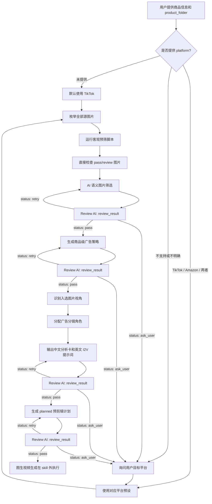

# I2V Prompt Skill 中文说明

这是一个用于 Claude Code 的 skill，专门面向海外电商家居与生活方式产品广告，生成第一阶段的图生视频结构化提示词。

## 仓库内容

- `ecom-i2v-ad-prompts/` —— 主 skill 定义与参考资料
- `ecom-i2v-prompt-generator/` —— 优化后的提示词生成器，输出 `01_storyboard_plan.md` 和 `02_i2v_prompt_manifest.json`
- `ecom-i2v-video-workflow/` —— 可自动执行的视频生产工作流，消费 prompt manifest，生成 clips，审查视频，生成 `04_final_edit_plan.json` 并合成最终视频
- `ecom-i2v-ad-prompts/scripts/prefilter_images.py` —— 图片客观预筛脚本
- `quick_validate.py` —— 仓库契约校验脚本
- `requirements.txt` —— 预筛与本地验证所需的 Python 依赖
- `docs/` —— 设计说明和补充文档
- `validation/` —— 本地验证输出与测试产物，不会上传到 GitHub

## Skill 的用途

这个 skill 以“一个商品文件夹”为单位工作。一个文件夹中的多张商品图会被视为同一个商品广告项目，而不是彼此独立的单张图片。

当前仓库已拆成两个新的推荐 skill：

1. `ecom-i2v-prompt-generator`：只负责分镜规划和提示词清单。
2. `ecom-i2v-video-workflow`：负责图生视频执行、clip 审查、最终剪辑计划和 ffmpeg 合成。

它主要负责第一阶段的规划工作：

1. 枚举商品文件夹中的所有图片
2. 执行客观图片预筛
3. 进行语义级图片筛选
4. 为入选图片分配广告分镜角色
5. 为每张图片生成中文分析卡和英文图生视频提示词
6. 输出用于生成前规划的 `planned_final_edit_plan.json`

它**不会**：

- 生成最终可执行的 `final_edit_plan.json`
- 审查已经生成出来的视频结果

## 必填输入

最小输入格式如下：

```yaml
product_name: ""
category: ""
target_audience: ""
selling_points:
  - ""
platform: "tiktok" # 默认；也可以是 "amazon" 或 ["tiktok", "amazon"]
product_folder: "/abs/path/to/product_images"
```

TikTok 是默认平台。如果 `platform` 缺失，直接按 TikTok 生成。如果用户提供的平台不受支持或语义不明确，再询问目标是 `tiktok`、`amazon`，还是两个都要。

可选字段：

- `campaign_goal`
- `brand_tone`
- `preferred_aspect_ratio`
- `video_model`

## 输出结构

skill 会按下面顺序输出结果：

1. `图片筛选结果`
2. `商品级广告策略`
3. `图片分镜规划表`
4. `逐图分析卡与生成参数`
5. `中文预剪辑说明`
6. `planned_final_edit_plan.json`

单平台任务输出 `planned_final_edit_plan.json`；双平台任务输出 `planned_final_edit_plan_tiktok.json` 和 `planned_final_edit_plan_amazon.json`，不要合并成一个折中版本。

## Skill 流程图



Review AI 统一返回：

```yaml
review_result:
  status: "pass" # pass | retry | ask_user
  failed_checks: []
  retry_instruction: ""
  user_question: ""
```

## 关键规则

- 一个文件夹代表一个商品广告项目，不要把其中图片当成互不相关的单图任务。
- 必须直接检查图片内容，不能只根据文件名判断视角或用途。
- 必须先执行客观预筛，再进行语义分析。
- 默认只为通过筛选的图片生成完整提示词。
- 分析内容用中文，生成提示词用英文。
- 单条生成片段建议控制在 5–10 秒之间，没有更强理由时默认 6 秒。
- 必须保留商品的真实身份、材质、比例和商业真实感。

## 预筛脚本用法

在进行语义筛选前，先运行内置脚本：

```bash
python -m pip install -r requirements.txt
```

```bash
python ecom-i2v-ad-prompts/scripts/prefilter_images.py "<product_folder>" --output "<product_folder>/image_prefilter_report.json"
```

这个预筛只是第一轮质量检查，用于识别损坏文件和一些客观风险，不能单独决定图片是否具有广告价值。

## 主要参考文件

- `ecom-i2v-ad-prompts/SKILL.md`
- `ecom-i2v-ad-prompts/references/image-selection-rules.md`
- `ecom-i2v-ad-prompts/references/platform-presets.md`
- `ecom-i2v-ad-prompts/references/prompt-template.md`
- `ecom-i2v-ad-prompts/references/view-to-video-strategy.md`

## 推荐目录结构

```text
ecom-i2v-ad-prompts/
├─ SKILL.md
├─ agents/
├─ references/
└─ scripts/
```

## 补充说明

- `validation/` 目录存放本地测试输出，已被版本控制忽略。
- Python 缓存文件已被忽略。
- 当前仓库主要聚焦在第一阶段的提示词规划流程。
